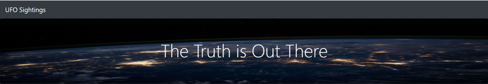
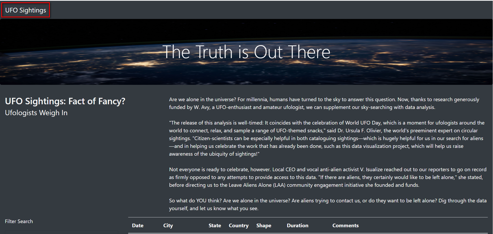
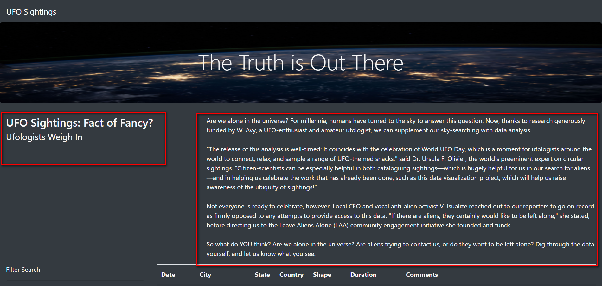
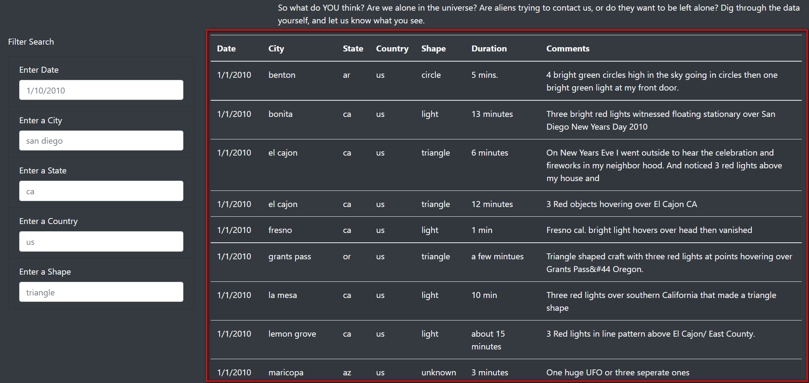
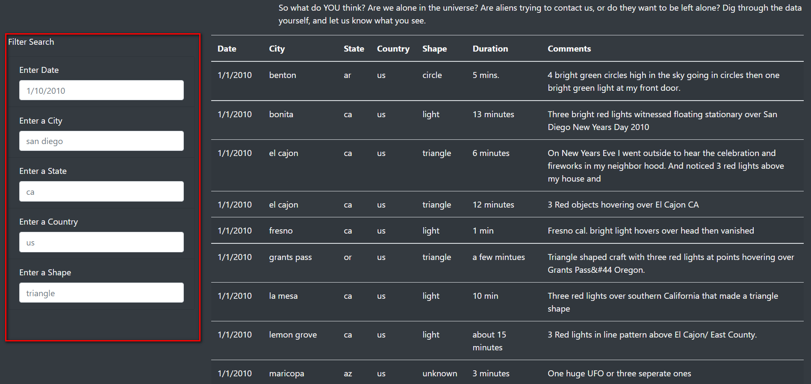

# UFOs website project

## Overview of Project: Explain the purpose of this analysis.
The purpose of this project is to use HTML, JavaScript and CSS in order to develop a responsive and dynamic website, which will allow 
a user to input information and to filter the data given. This data, is about UFO sightings and includes the following information:
Date, City, State, Country, Shape, Duration, Comments. 

## Results: 
In the following content a guide on how to use the webpage will be found.

### Navigation Bar
When clicking this bar the filtered information can be reloaded and the default information will be displayed.   

### Title and Paragraph Information 
here the title of the article (left) and article content (right) can be shown.  

### Table ad UFO Data
In this section the data is displayed in a table. This information is about where, when and how the UFO events happened.  

### Filter Data
If it is needed to filter the data in the table content, here the user may input the required information the same way the placeholder example is shown.   

## Summary: 
One disadvantage regarding the website is that there is not enough explanation on how the country and state are abbreviated, thus the user might find problems when filtering the Data.
It is recommended for future development, to include how the content is abbreviated as well as additional information with more dates and countries, due to the 
fact that in this case the information is only in the us, so it does not make sense to create a country filter. 